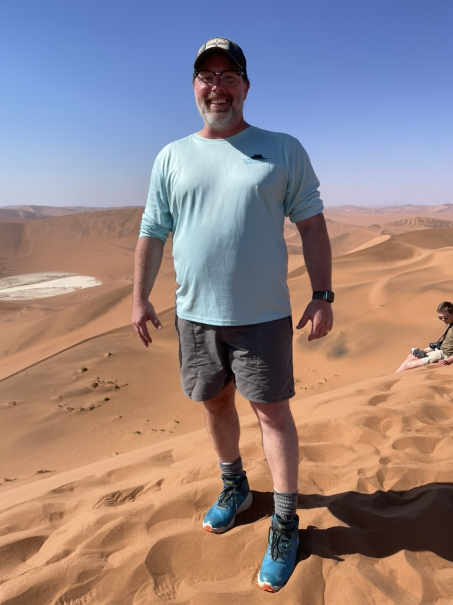

::: {.home-hero}

::: {.hero-text}
[Professor · School of Natural Resources · UNL]{.specimen-label}

# Christopher Chizinski

[Human dimensions of wildlife & fisheries.]{.hero-tagline} I study who hunts and
fishes, how participation changes over time, and what that means for the agencies
that manage public resources.

I combine survey science, quantitative methods, and reproducible data analysis
to study participation, behavior, harvest, and decision-making. Much of this
work involves creel and angler surveys, capture–recapture methods, recruitment,
retention, and reactivation (R3), and open-source R tools for conservation
research and management.

I teach undergraduate courses in human dimensions and natural resource policy,
and graduate courses in R programming, data visualization, and reproducible
science, and help lead the School's research and graduate programs.

<a href="https://github.com/chrischizinski" aria-label="GitHub"><i class="bi bi-github"></i> GitHub</a>
<a href="https://bsky.app/profile/chrischizinski.bsky.social" aria-label="Bluesky"><i class="bi bi-cloud"></i> Bluesky</a>
<a href="mailto:cchizinski2@unl.edu" aria-label="Email"><i class="bi bi-envelope"></i> Email</a>
<a href="blog.xml" aria-label="RSS"><i class="bi bi-rss"></i> RSS</a>

:::

::: {.hero-photo}
{fig-alt="Chris Chizinski on Big Daddy Dune in the Sossusvlei area of the Namib Desert"}
:::

:::

::: {.home-tiles}

<a class="home-tile" href="blog.html">
01 · Notes
Blog
R, data analysis, and creel survey methods.
</a>

<a class="home-tile" href="projects.html">
02 · Software
Projects
tidycreel, dashboards, and open-source tools.
</a>

<a class="home-tile" href="cv.html">
03 · Record
CV
Publications, teaching, and funding.
</a>

<a class="home-tile" href="https://humandimensions.unl.edu">
04 · Group
Lab&nbsp;↗
Members, current projects, and joining the group.
</a>

:::
