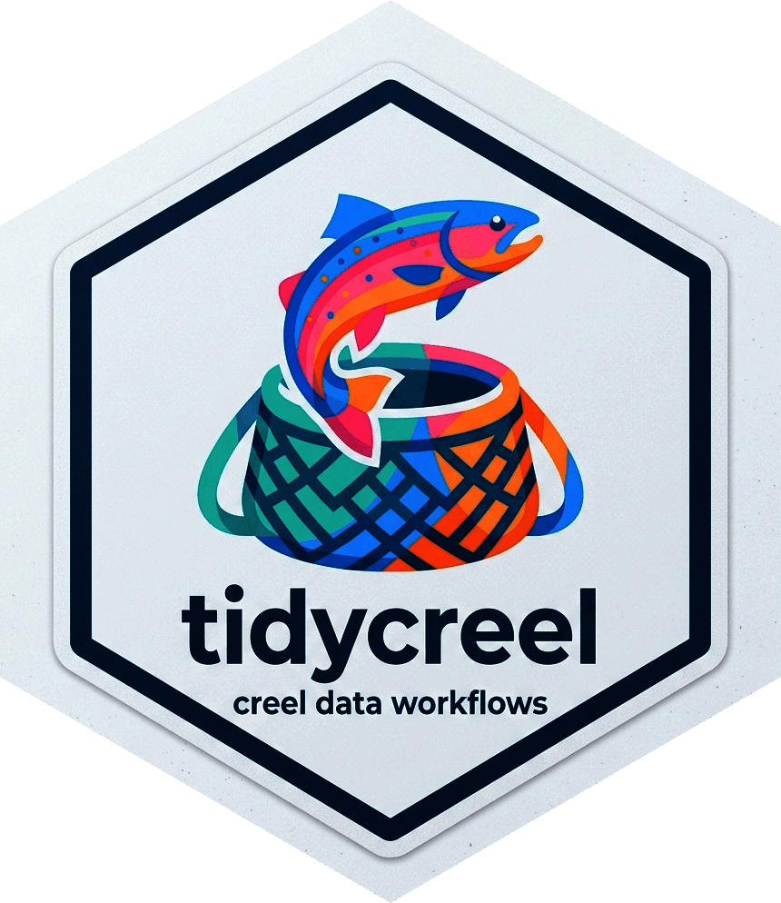
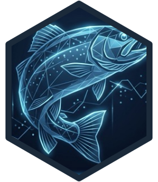
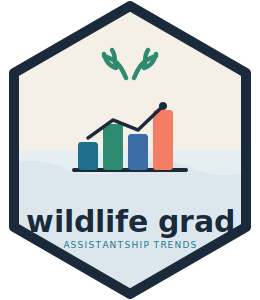
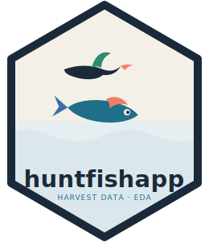
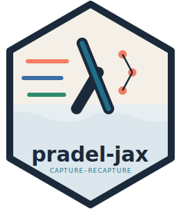

[Open source · lab & research tools]{.specimen-label}

Open-source tools and dashboards from my lab and research.

::: {.grid}

::: {.g-col-12 .g-col-md-6}
::: {.card .project-card}
::: {.card-body}
{.project-hex fig-alt="tidycreel hex logo"}

[R Package]{.project-tag}

[tidycreel]{.card-title}

Tidy R tools for creel survey design, estimation, validation, and
management-ready reporting.

<a href="https://chrischizinski.github.io/tidycreel/"><i class="bi bi-globe"></i> Website</a>
<a href="https://github.com/chrischizinski/tidycreel"><i class="bi bi-github"></i> GitHub</a>

:::
:::
:::

::: {.g-col-12 .g-col-md-6}
::: {.card .project-card}
::: {.card-body}
{.project-hex fig-alt="Modern Creel Survey Analysis book hex logo"}

[Quarto Book]{.project-tag}

[Modern Creel Survey Analysis in R]{.card-title}

Methods-first Quarto book on design-based creel survey analysis with `tidycreel`
— design, estimation, diagnostics, and reporting. Companion to the package.

<a href="https://modern-creel-surveys.netlify.app"><i class="bi bi-globe"></i> Website</a>
<a href="https://github.com/chrischizinski/modern-creel-surveys"><i class="bi bi-github"></i> GitHub</a>

:::
:::
:::

::: {.g-col-12 .g-col-md-6}
::: {.card .project-card}
::: {.card-body}
{.project-hex fig-alt="Wildlife Grad Dashboard hex logo"}

[R Dashboard]{.project-tag}

[Wildlife Grad Dashboard]{.card-title}

Public trends dashboard tracking U.S. wildlife and natural resources graduate
assistantship postings — salaries, timing, and geography.

<a href="https://chrischizinski.github.io/wildlife-grad-dashboard/"><i class="bi bi-globe"></i> Website</a>
<a href="https://github.com/chrischizinski/wildlife-grad-dashboard"><i class="bi bi-github"></i> GitHub</a>

:::
:::
:::

::: {.g-col-12 .g-col-md-6}
::: {.card .project-card}
::: {.card-body}
{.project-hex fig-alt="huntfishapp hex logo"}

[Shiny App]{.project-tag}

[huntfishapp]{.card-title}

Web-based exploratory data analysis application for hunting, fishing, and
outdoor recreation sales data.

<a href="https://chrischizinski.github.io/huntfishapp"><i class="bi bi-globe"></i> Website</a>
<a href="https://github.com/chrischizinski/huntfishapp"><i class="bi bi-github"></i> GitHub</a>

:::
:::
:::

::: {.g-col-12 .g-col-md-6}
::: {.card .project-card}
::: {.card-body}
{.project-hex fig-alt="pradel-jax hex logo"}

[Python · JAX]{.project-tag}

[pradel-jax]{.card-title}

Modern JAX-based optimization framework for Pradel capture–recapture models.

<a href="https://github.com/chrischizinski/pradel-jax"><i class="bi bi-github"></i> GitHub</a>

:::
:::
:::

:::
